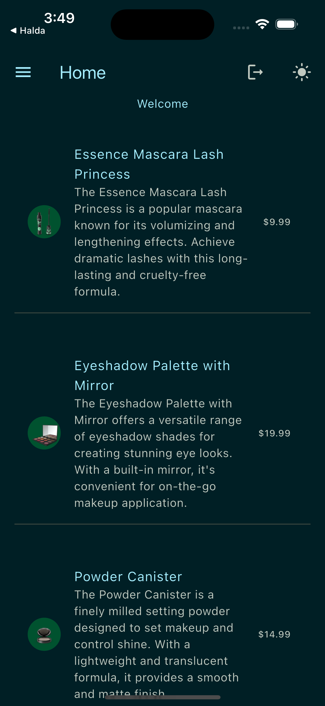
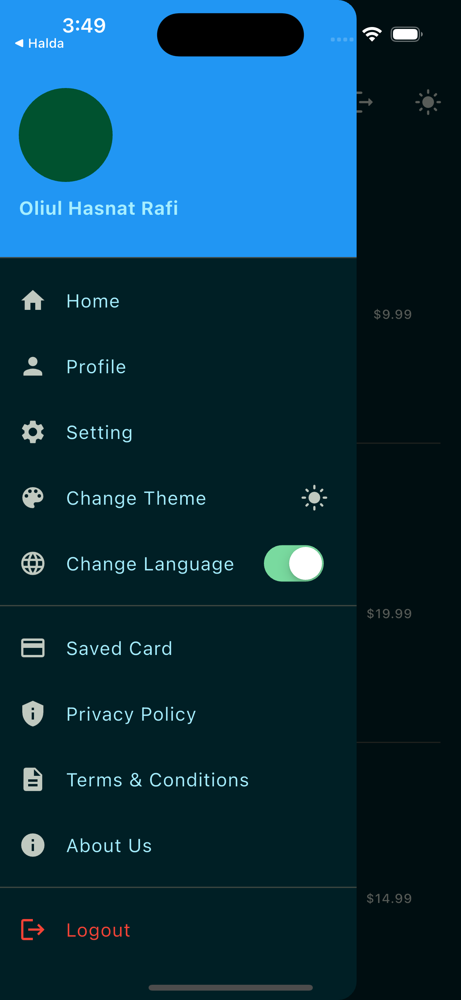

# Photos

A modern Flutter application built with the GetX state management framework. This template provides a clean, scalable architecture for developing cross-platform mobile applications.

## Table of Contents

- [Features](#features)
- [Project Structure](#project-structure)
- [Screenshots](#screenshots)
- [Technology Stack](#technology-stack)
- [Prerequisites](#prerequisites)
- [Setup Instructions](#setup-instructions)
- [Running the App](#running-the-app)
- [Internationalization](#internationalization)
- [Testing](#testing)
- [Contributing](#contributing)
- [License](#license)

## Features

- **GetX State Management**: Efficient and reactive state management
- **Clean Architecture**: Well-organized code structure for maintainability
- **Multi-platform Support**: Android, iOS, web, and desktop compatibility
- **Responsive Design**: Using flutter_screenutil for responsive layouts
- **Theme Management**: Customizable and reactive theming
- **Local Storage**: Using get_storage for persistent data storage
- **Internationalization**: Multi-language support with built-in localization
- **Custom Widgets**: Reusable custom UI components
- **API Integration**: Network layer for handling REST API calls using Dio
- **Error Handling**: Comprehensive error handling strategies
- **Permission Management**: Easy permission handling for device features
- **Sharing Capabilities**: Ability to share content with other apps

## Project Structure

The project follows a modular architecture for better maintainability and scalability:

```
lib/
├── l10n/                  # Internationalization resources
├── src/                   # Core application logic
│   ├── controller/        # GetX controllers
│   │   ├── data_controller/  # Data management controllers
│   │   ├── screen_controller/ # Screen-specific controllers
│   │   ├── service/       # Various services
│   │       ├── api/       # API service integration
│   │       ├── error_handlers/ # Error handling logic
│   │       ├── functions/ # Service utility functions
│   │       ├── local_data/ # Local data storage
│   ├── core/              # Core utilities
│   │   ├── theme/         # App theming
│   │   ├── utils/         # Utility functions
│   │   ├── validators/    # Input validation
│   │   ├── values/        # Constants and configurations
│   ├── model/             # Data models
│   │   ├── app_model.dart/ # Core app models
│   │   ├── pogo_model/    # Plain Dart objects
│   │   ├── response_model/ # API response models
│   ├── view/              # UI components
│       ├── home/          # Home screen UI
│       ├── screen/        # Other screens
│       ├── widget/        # Reusable widgets
├── components.dart        # Shared components
├── main.dart              # Application entry point
```

### Key Directories

- `lib/src/controller/`: Contains GetX controllers for managing state and business logic, organized into data and screen-specific controllers.
- `lib/src/service/`: Manages API calls, error handling, and local data storage, ensuring separation of concerns.
- `lib/src/core/`: Houses reusable utilities, themes, validators, and constants for consistent app behavior.
- `lib/src/model/`: Defines data models, including app-specific models, POGOs, and API response models.
- `lib/src/view/`: Contains UI code for screens and reusable widgets, following a modular design.
- `lib/l10n/`: Contains localization files for internationalization support.
- `assets/`: Stores static assets like images, icons, and flag images for language selection.

## Screenshots

Here are some screenshots of the application:

<div align="center">
  
  
</div>

## Technology Stack

This template uses the following packages and technologies:

- **UI & Responsive Design**:
  - flutter_screenutil: ^5.9.0
  - google_fonts: ^6.1.0
  - flutter_svg: ^2.0.9
  - on_process_button_widget: ^2.0.2
  - on_popup_window_widget: ^0.0.8

- **State Management & Routing**:
  - get: ^4.6.6 (GetX framework)
  - go_router: ^15.0.0
  - get_it: ^8.0.3 (Dependency injection)

- **Data & Storage**:
  - get_storage: ^2.1.1
  - path_provider: ^2.1.5
  - intl: ^0.19.0

- **Networking**:
  - http: ^1.1.2
  - dio: ^5.8.0+1

- **Platform Features**:
  - permission_handler: ^11.0.1
  - share_plus: ^10.1.4
  - fluttertoast: ^8.2.4

## Prerequisites

- Flutter SDK ^3.5.4
- Dart SDK (comes with Flutter)
- A code editor (VS Code, Android Studio, etc.)
- Git for version control
- Platform-specific requirements:
  - **Android**: Android SDK
  - **iOS**: Xcode (macOS only)
  - **Web**: Chrome or another modern browser
  - **Desktop**: Platform-specific requirements

## Setup Instructions

1. **Clone the repository**:

   ```bash
   git clone https://github.com/yourusername/photos.git
   cd photos
   ```

2. **Install dependencies**:

   ```bash
   flutter pub get
   ```

3. **Configure environment variables** (if needed):
   
   Create a `.env` file in the project root with any required API keys or configuration.

4. **Run the application**:

   ```bash
   flutter run
   ```

## Running the App

Run on specific platforms with:

- **Android/iOS (default)**:
  ```bash
  flutter run
  ```

- **Web**:
  ```bash
  flutter run -d chrome
  ```

- **Desktop** (macOS example):
  ```bash
  flutter run -d macos
  ```

Build a release version:
```bash
flutter build <platform>
```

## Internationalization

This project supports multiple languages. The localization files are located in the `lib/l10n/` directory.

To add a new language:
1. Create a new ARB file in the `lib/l10n/` directory
2. Add translations for all strings
3. Register the new locale in `main.dart`

## Testing

Run tests with:

```bash
flutter test
```

The `test/` directory contains unit and widget tests to ensure code quality and reliability.

## Contributing

Contributions are welcome! To contribute:

1. Fork the repository
2. Create a feature branch: `git checkout -b feature/your-feature-name`
3. Commit your changes: `git commit -m 'Add some feature'`
4. Push to the branch: `git push origin feature/your-feature-name`
5. Open a pull request

Please ensure your code follows project coding standards and includes appropriate tests.

## License

This project is licensed under the MIT License - see the LICENSE file for details.

---

Last updated: April 27, 2025
